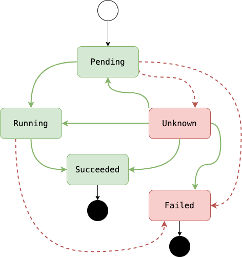

# Observing Kubernetes Pod Lifecycle

## -- Big Picture -----------

## -- In A Nutshell ---------

The states of a Pod's lifecycle are:

- Pending: In the process of being scheduled and run

- Running: Running within the cluster

- Succeeded: Finished operation normally

- Failed: Finished operation crashed

- Unknown: Internal problem happening

## -- Get Your Hands Dirty --

