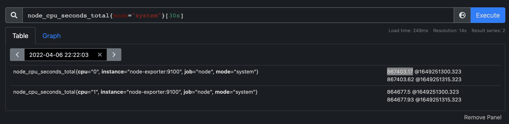

---
tags:
 - prometheus
---

# prometheus rate avg 関数

CPUのsystemモードの使用率をstep by stepで、下記のデモン環境を用いて検証しました。

https://bit.ly/3uXhUrB

```
sum(avg without(cpu) (rate(node_cpu_seconds_total{mode="system"}[30s])))by (instance)
```

## node_cpu_seconds_totalメトリクス



PromSQL:

```
node_cpu_seconds_total{mode="system"}[30s]
```

- `node_cpu_seconds_total{mode="system"}`

システム起動されてから、`2022-04-06 22:22:03`までに、`system`モードでCPUが稼働していた`秒数`である。

- `node_cpu_seconds_total{mode="system"}[30s]`

`2022-04-06 22:22:03`から30秒前まで(22:21:33 - 22:22:03)のデータポイントを取得する。

`cpu="0"`の場合：
1649251300.323 = 22:21:40.323
1649251315.323 = 22:21:55.323

`node_cpu_seconds_total`は、`Node Exporter`によるスクレイプされるメトリクスで、スクレイプ間隔15秒でありる。

よって、上記クエリで２つのデータポイントが取得される。

## rate 関数


PromSQL:

```
rate(node_cpu_seconds_total{mode="system"}[30s])
```

`cpu="0"`のrateの計算方法は、

```
(867403.62s - 867403.17s)/(1649251315.323s - 1649251300.323s)
= 0.45s / 15s
= 0.03
```

rateは、カウントの変化量を、指定される期間で割る。

rateのカウントの変化量は、一番最近のデータから、一番古いデータを引く。

irateのカウントの変化量は、一番最近のデータから、二番目最近のデータを引く。

このケースにおいて、データポイント２つしかないので、rateとirateは同じ結果になる。

## avg 関数

```
avg without(cpu) (rate(node_cpu_seconds_total{mode="system"}[30s]))
```

`cpu="0"`と`cpu="1"`の平均値を求める。


(0.02999999999689559 + 0.028666666670081515)/2
= 0.02933333
