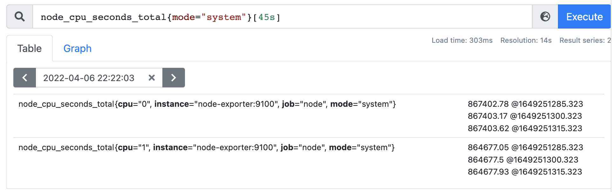

---
tags:
 - prometheus
---

# prometheus rate avg 関数

CPUのsystemモードの使用率をstep by stepで、下記のデモン環境を用いて検証した。

https://bit.ly/374yBtd

こちらのデモン環境をアクセスすると、リアルに値を確認できる。

```
avg without(cpu) (rate(node_cpu_seconds_total{mode="system"}[45s]))
```

## node_cpu_seconds_totalメトリクス




1. `node_cpu_seconds_total{mode="system"}`
  システム起動されてから、**2022-04-06 22:22:03**までに、**system**モードでCPUが稼働していた`秒数`である。

2. `node_cpu_seconds_total{mode="system"}[45s]`
  **2022-04-06 22:22:03** から45秒前まで(22:21:08 - 22:22:03)のデータポイントを取得する。
  **node_cpu_seconds_total**は、**Node Exporter**によるスクレイプされるメトリクスで、スクレイプ間隔15秒でありる。

よって、上記クエリで3つのデータポイントが取得される。

## rate 関数


PromSQL:

```
rate(node_cpu_seconds_total{mode="system"}[45s])
```

rateは、カウントの変化量を、指定される期間で割る。

rateのカウントの変化量は、一番最近のデータから、一番古いデータを引く。

よって、`cpu="0"`のrateは、
```
(867403.62s - 867402.78s)/(1649251315.323s - 1649251285.323s)
= 0.84s / 30s
= 0.028
```

## irate 関数


irateのカウントの変化量は、一番最近のデータから、二番目最近のデータを引く。

よって、`cpu="0"`のrateは、

```
(867403.62s - 867403.17s)/(1649251315.323s - 1649251300.323s)
= 0.45s / 15s
= 0.03
```

## avg 関数

```
avg without(cpu) (rate(node_cpu_seconds_total{mode="system"}[45s]))
```

`cpu="0"`と`cpu="1"`の平均値を求める。


(0.027999999998913457 + 0.029333333333488552)/2
= 0.02866667
