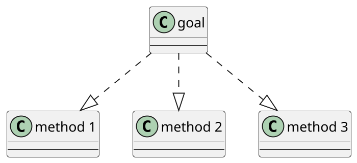
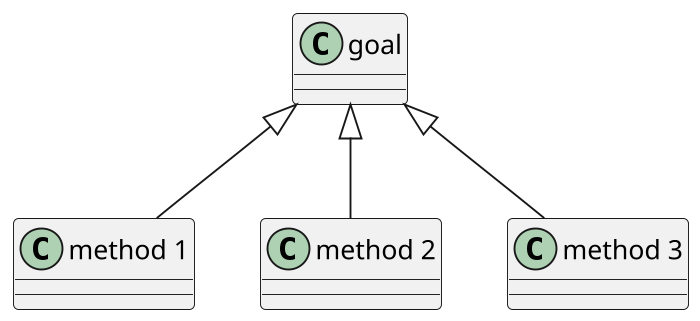

# thinking

## design thinking

明確なゴールがあって、それを実現するための方法を考えてゆく。
抽象的なゴールを具体化して行くプロセス。

```plantuml
@startuml
scale 700 width

goal ..|> "method 1"
goal ..|> "method 2"
goal ..|> "method 3"

@enduml
```

## critical thinking

```plantuml
@startuml
scale 700 width

goal <|-- "method 1"
goal <|-- "method 2"
goal <|-- "method 3"

@enduml
```