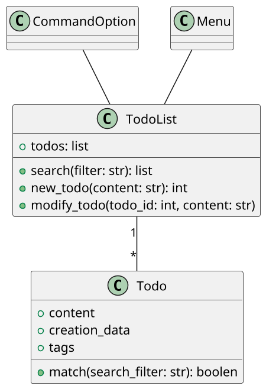

# todo app OOA OOD OOP

A simple command-line todo application.

[Python 3 Object-oriented Programming - Second Edition](https://learning.oreilly.com/library/view/python-3-object-oriented/9781784398781/)

## OOA

ALl todos are stored in the todo list.
Each todo should be able to change state.
It should be possible to modify todos.
It also need to be able to search for Todos.
All of these things should be done from the command line.

## OOD

top-down design with class diagram



## OOP

```shell
todo/
 |- __init__.py
 |- todolist.py
 |- menu.py
 |- command_option.py
```

```python
import datetime


```