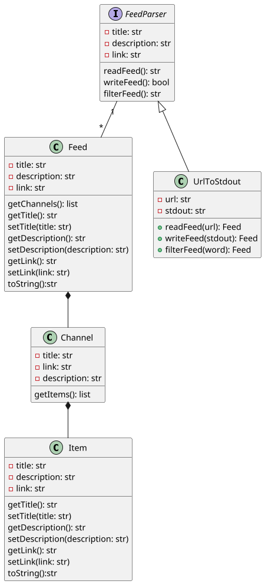

# RssFilter OOA OOD OOP

## OOA

requirements (what needs to be done.)

* 変換:「xxx」という文字を取り除く
* 出力:変換結果を標準出力に表示する
* 入力RSSを複数にする
* 処理途中でエラーが発生したら標準エラー出力にエラー内容を表示する
* 出力を標準出力に表示するだけでなく、テキストファイルに保存する

## OOD

specification (how things should be done.)



## OOP

```python
#!/usr/bin/env python3
# -*- coding: utf8 -*-

from urllib.request import urlopen
import urllib.error
import sys


class FeedParser(object):

    def readFeed(self):
        raise NotImplementedError( "Should have implemented this" )
    def writeFeed(self):
        raise NotImplementedError( "Should have implemented this" )
    def filterFeed(self):
        pass

class UrlToStdout(FeedParser):
    def __init__(self, url):
        self.url = url

    def readFeed(self):
        url = self.url
        try:
            with urlopen(url) as response:
                html_response = response.read()
                encoding = response.headers.get_content_charset('utf-8')
                feed_str = html_response.decode(encoding)
        except urllib.error.URLError as e:
            print(e.reason)
            feed_str = None
        return feed_str

    def writeFeed(self, feed_str):
        sys.stdout.write(feed_str)
        return True

    def removeWord(self, feed_str, word):
        feed_str = feed_str.replace(word, '')
        return feed_str

if __name__ == "__main__":

    urls = ['http://xxx/rss']
    word = 'xxx'

    for url in urls:
        iUrlToStdout = UrlToStdout(url)
        feed_str = iUrlToStdout.readFeed()
        if feed_str:
            feed_str = iUrlToStdout.removeWord(feed_str, word)
            iUrlToStdout.writeFeed(feed_str)

```