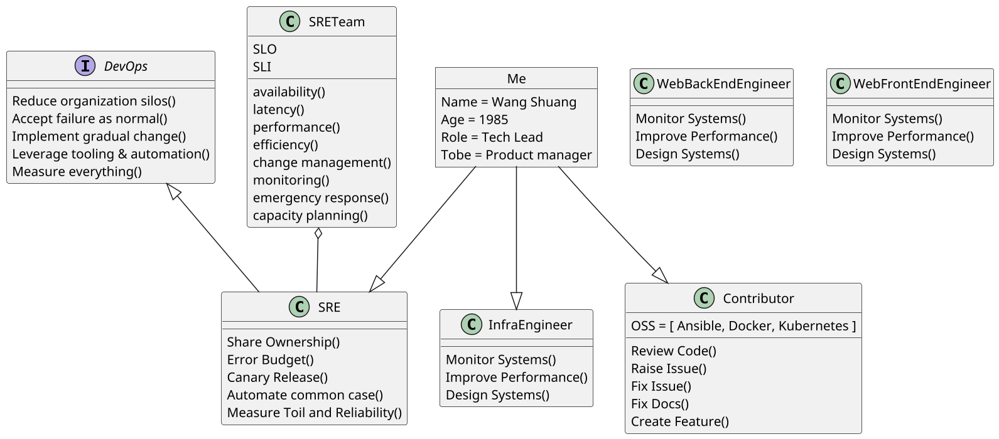

# About me

```plantuml
@startuml
scale 800 width
scale 700 height

Interface DevOps{
    Reduce organization silos()
    Accept failure as normal()
    Implement gradual change()
    Leverage tooling & automation()
    Measure everything()
}

Class SRE{
    Share Ownership()
    Error Budget()
    Canary Release()
    Automate common case()
    Measure Toil and Reliability()
}

Class WebBackEndEngineer{
    Monitor Systems()
    Improve Performance()
    Design Systems()
}

Class WebFrontEndEngineer{
    Monitor Systems()
    Improve Performance()
    Design Systems()
}

Class InfraEngineer{
    Monitor Systems()
    Improve Performance()
    Design Systems()
}

Class Contributor{
    OSS = [ Ansible, Docker, Kubernetes ]
    Review Code()
    Raise Issue()
    Fix Issue()
    Fix Docs()
    Create Feature()
}

Class SRETeam{
    SLO
    SLI
    availability()
    latency()
    performance()
    efficiency()
    change management()
    monitoring()
    emergency response()
    capacity planning()
}

Object Me
Me : Name = Wang Shuang
Me : Age = 1985
Me : Role = Tech Lead
Me : Tobe = Product manager


DevOps <|-- SRE
SRETeam o-- SRE

Me --|> Contributor
Me --|> SRE
Me --|> InfraEngineer

@enduml
```
