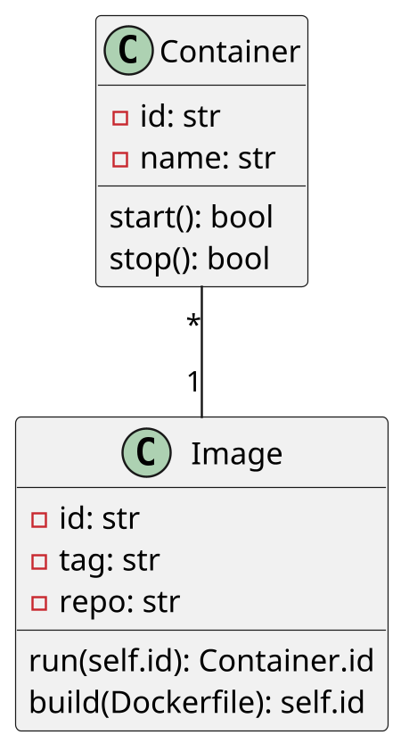

# ood4docker

コンテナーをオブジェクト思考で捉えてみます。

## docker images and container

```plantuml
@startuml
scale 450 width

Class Image{
    -id: str
    -tag: str
    -repo: str

    run(self.id): Container.id
    build(Dockerfile): self.id

}

Class Container{
    -id: str
    -name: str

    start(): bool
    stop(): bool
}

Container "*" -- "1" Image
@enduml
```