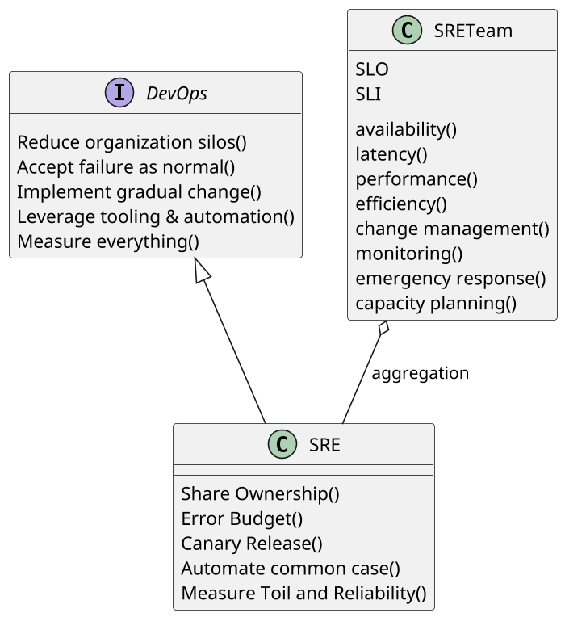

# What is SRE

## class SRE implements DevOps

[competing standards or close friends](https://cloud.google.com/blog/products/gcp/sre-vs-devops-competing-standards-or-close-friends)

```plantuml format="png"
@startuml
scale 700 width
interface DevOps{
    Reduce organization silos()
    Accept failure as normal()
    Implement gradual change()
    Leverage tooling & automation()
    Measure everything()
}

class SRE{
    Share Ownership()
    Error Budget()
    Canary Release()
    Automate common case()
    Measure Toil and Reliability()
}

class SRETeam{
    SLO
    SLI
    availability()
    latency()
    performance()
    efficiency()
    change management()
    monitoring()
    emergency response()
    capacity planning()
}

DevOps <|-- SRE

SRETeam o-- SRE : aggregation

@enduml
```