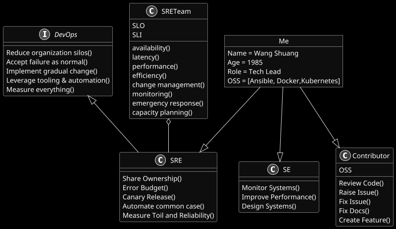

```plantuml
@startuml
scale 800 width
skinparam monochrome reverse

interface DevOps{
    Reduce organization silos()
    Accept failure as normal()
    Implement gradual change()
    Leverage tooling & automation()
    Measure everything()
}

class SRE{
    Share Ownership()
    Error Budget()
    Canary Release()
    Automate common case()
    Measure Toil and Reliability()
}
Class SE{
    Monitor Systems()
    Improve Performance()
    Design Systems()
}
Class Contributor{
    OSS
    Review Code()
    Raise Issue()
    Fix Issue()
    Fix Docs()
    Create Feature()
}

class SRETeam{
    SLO
    SLI
    availability()
    latency()
    performance()
    efficiency()
    change management()
    monitoring()
    emergency response()
    capacity planning()
}

object Me
Me : Name = Wang Shuang
Me : Age = 1985
Me : Role = Tech Lead
Me : OSS = [Ansible, Docker,Kubernetes]


DevOps <|-- SRE
SRETeam o-- SRE

Me --|> Contributor
Me --|> SRE
Me --|> SE

@enduml
```
